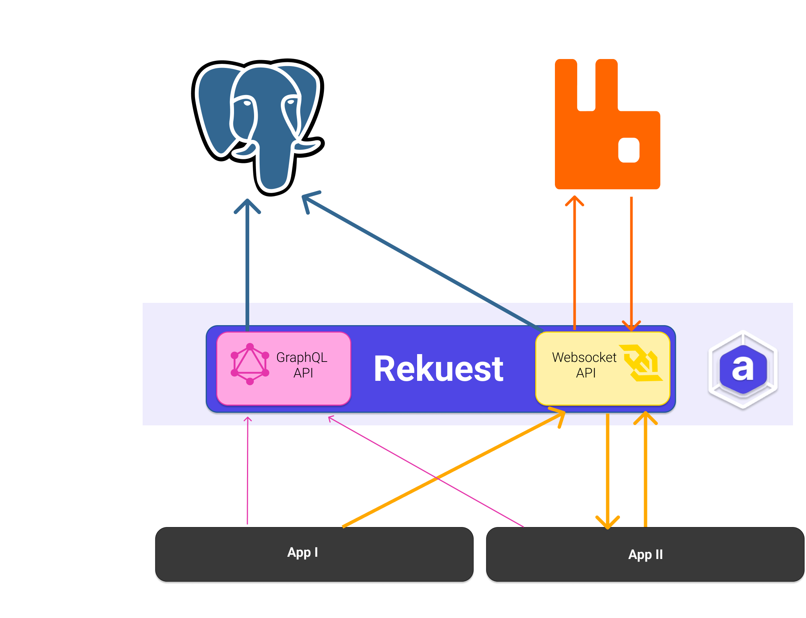

# Rekuest-Server (Next)

Rekuest is one of the core services of Arkitekt. It represents a central repository of
all the connected apps and their provided functionality, their [Actions](https://arkitekt.live/docs/terminology/actions).
It also provides ways of interacting with the apps, by providing a central access point, that
apps and users can assign tasks to. Rekuest then takes care of routing the requests to the
appropriate app, which executres the task and returns the result to rekuest, which in turn routes it back
to the caller. Similar to all other Arkitekt ervices, Rekuest exposes a GraphQL API, that can be used to interact with it.
You can find the interactive documentation for the API [here](https://arkitekt.live/explorer).

> [!NOTE]  
> What you are currently looking at is the next version of rekuest. It is currently under development and not ready for production. If you are looking for the current version of Rekeust, you can find it [here](https://github.com/arkitektio/rekuest-server).

## Rekuest Design

Rekuest itself is designed as a stateless service (in order to be able to scale horizontally), and
interfaces with proven open-source technologies, such as [Redis](https://redis.io/) and [RabbitMQ](https://www.rabbitmq.com/).
to route tasks to the appropriate apps. The following diagram shows the high-level design of Rekuest:

## Developmental Notices

Rekuest is currently being rewritten to support other message brokers, such as [Kafka](https://kafka.apache.org/). This will
however remain an opt-in feature, and RabbitMQ will remain the default message broker. To learn more about this design decision,
please refer to the [Why Not?](https://arkitekt.live/docs/design/why-not) section.

You can find the current developmental action of Rekuest [here](https://github.com/arkitektio/rekuest-server-next)
Efforts from this new repository will be merged into this repository once the new version is ready for production.

