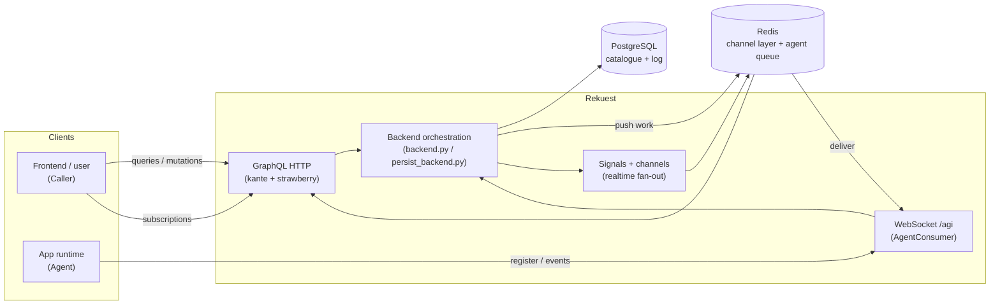

# Rekuest — Design Documentation

This folder is the **authoritative architecture reference** for the `rekuest` service. It explains
*why* the major elements exist and *how* a request flows end-to-end, rather than just listing the
GraphQL surface (see [`../API_DOCUMENTATION.md`](../API_DOCUMENTATION.md) for that) or the dev
workflow (see [`../DEVELOPMENT.md`](../DEVELOPMENT.md)).

> These documents describe the code as it stands today. Where a name recently changed (e.g.
> `Registry` → `Caller`), a short historical note is included so older code still reads sensibly.

## What is Rekuest?

Rekuest is the broker at the centre of the [Arkitekt](https://arkitekt.live) ecosystem. It is a
**GraphQL + WebSocket facade** that mediates between two kinds of participants:

- **Callers** — users and frontend apps that *request* work ("run this action with these args").
- **Agents** — connected runtimes that *provide* implementations and actually *execute* the work.

A caller never talks to an agent directly. It issues a GraphQL `assign`; Rekuest resolves which
implementation/agent should run it, records an `Assignation`, pushes the work to the agent over a
WebSocket, persists the events the agent streams back, and re-broadcasts them to the caller over a
GraphQL subscription. Rekuest owns the **catalogue** (which actions exist, who can run them, with
what data types) and the **routing + bookkeeping**; it does not run user code itself.

## How the service boots

`rekuest/asgi.py` assembles one ASGI application via kante's `router`:

- **HTTP GraphQL** is served from `facade.schema.schema` (a `kante.Schema` with `Query` /
  `Mutation` / `Subscription` roots) at the `schema` path.
- **WebSockets** are routed by `re_dynamicpath(r"agi", AgentConsumer.as_asgi())` — every agent
  connection lands on `facade.consumers.async_consumer.AgentConsumer`.

Configuration is loaded from `config.yaml` via OmegaConf in `rekuest/settings.py`. The settings
that shape runtime behaviour the most:

| Setting | Role |
| --- | --- |
| `AGENT_HEARTBEAT_INTERVAL` | How often the server pings a connected agent. |
| `AGENT_HEARTBEAT_RESPONSE_TIMEOUT` | How long the agent has to answer a ping before it is closed. |
| `AGENT_DISCONNECTED_TIMEOUT` | Liveness window used when judging whether an agent is still "active". |
| `AGENT_REDIS_HOST` / `AGENT_REDIS_PORT` | Redis used by the hand-rolled agent message queue. |
| Channel layer (`channels_redis`) | Redis backing the realtime subscription fan-out. |

Persistence is PostgreSQL — the relational port-matching engine relies on Postgres-specific
features (`jsonb_path_match`, JSONPath), so Postgres is required in any environment that exercises
action matching.

## Reading order

Start at the top and follow the flow of a request:

1. **[identity.md](identity.md)** — the `(client, user, organization)` triple, and the two
   identities it powers: **Caller** (who asks) and **Agent** (who provides). Read this first;
   everything else references it.
2. **[domain-model.md](domain-model.md)** — the full data model with an ER diagram and the
   uniqueness/cardinality rules that encode the business logic.
3. **[action-matching.md](action-matching.md)** — how an Action's `provides`/`requires`
   descriptors compile to JSONPath and how the relational port engine finds matching actions.
4. **[assignation-lifecycle.md](assignation-lifecycle.md)** — `assign` / `reserve`, the
   Assignation event state machine, and how results flow back to the caller.
5. **[agent-protocol.md](agent-protocol.md)** — the WebSocket wire protocol: register,
   authenticate, heartbeat, task delivery, connection takeover.
6. **[realtime.md](realtime.md)** — channels, signals, topic keys, and how subscriptions consume
   them.
7. **[higher-order.md](higher-order.md)** — higher-order implementations (one implementation
   wrapping another) and server-side event unfolding.
8. **[provenance.md](provenance.md)** — Rekuest as the provenance authority: the signed
   attestation token minted at dispatch, its claim vocabulary, the human-root invariant, and the
   JWKS endpoint downstream services verify against.

## The one-paragraph mental model

Everything is anchored on the `(client, user, organization)` identity triple derived from the auth
token. A **Caller** is that triple acting as a requestor; an **Agent** is that triple (plus an
app/release/device) acting as a provider. An **Action** is an abstract, versioned function
contract; an **Implementation** binds an Action to an Agent. A caller's `assign` creates an
**Assignation** (the execution log) stamped with the caller, routed to an agent; the agent streams
**AssignationEvents** back, which are persisted and fanned out to the caller's realtime channel
`ass_caller_{id}`. **Reservations** are standing pools that pre-bind a set of implementations for
repeated assignment. That is the whole system in miniature; the rest is detail.
