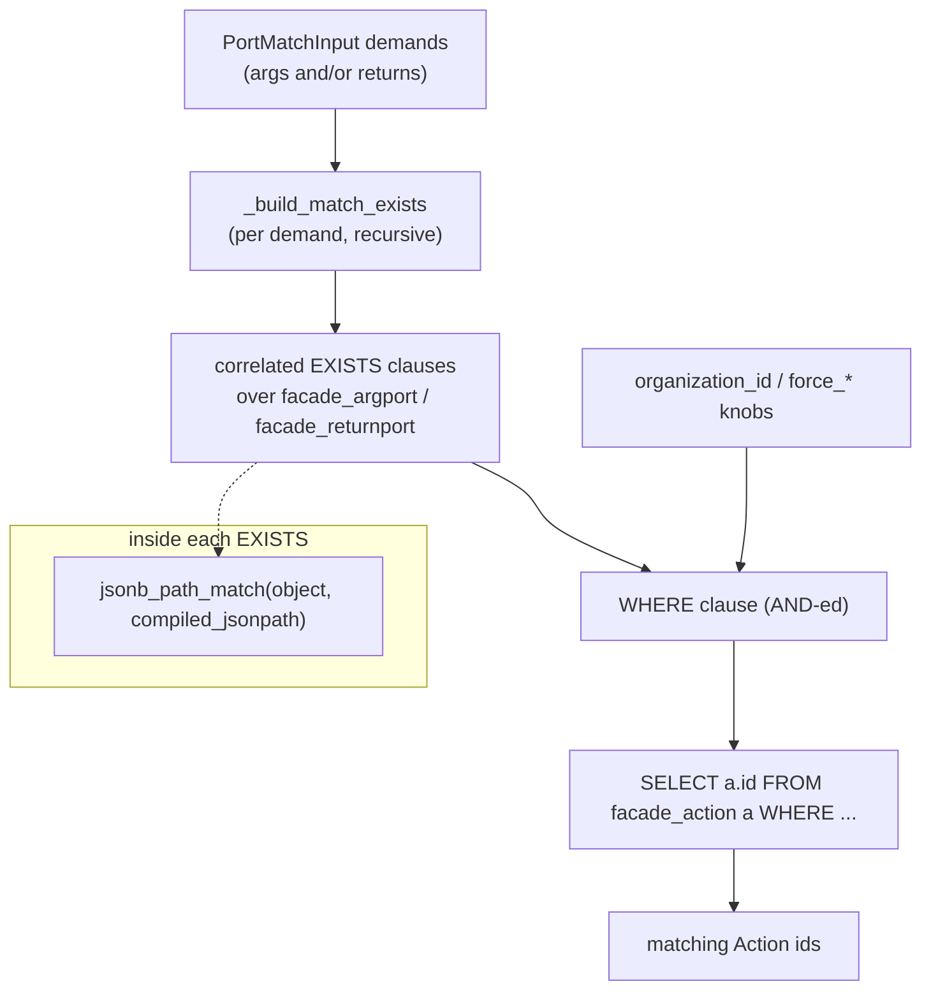

# Action Matching: provides / requires & the relational port engine

Rekuest's catalogue is large and heterogeneous. A central problem is: *given a demand on a port's
shape and the data flowing through it, which Actions satisfy it?* This document describes the two
halves of the answer — the **descriptor compiler** (`facade/descriptors.py`) that turns
`requires`/`provides` micro-constraints into PostgreSQL JSONPath, and the **relational port engine**
(`facade/managers.py`) that turns a port demand into indexed SQL.

## The two levels of matching

A port match operates at two levels:

1. **Structural** — does a port with this `key` / `kind` / `identifier` / `nullable` / `index`
   exist (possibly nested)? This is matched against the relational `ArgPort` / `ReturnPort` rows.
2. **Data (micro-constraint)** — does the *data descriptor* flowing through that port satisfy the
   port's `requires` (inputs) or `provides` (outputs) constraints? e.g. "this image port requires
   `axes == "c"` and `channels >= 3`". This is matched with PostgreSQL `jsonb_path_match`.

The first level finds candidate ports; the second filters them by the actual data semantics.

## Why relational ports (and not a JSONB scan)

Historically an Action's ports lived only as `args`/`returns` JSONB blobs, and matching meant a
sequential scan deserializing every action's blob. That does not use indexes and degrades with
catalogue size.

The relational engine flattens ports into the indexed `facade_argport` / `facade_returnport` tables
(populated when an implementation is created). Matching an Action then becomes a set of **correlated
`EXISTS` subqueries** over those tables, which:

- uses the `(action_id, parent_id)`, `kind`, and `identifier` indexes,
- supports **arbitrary nesting depth** via the self-referential `parent` FK,
- enforces the compiled micro-constraints with `jsonb_path_match` inside the same query.

The legacy JSONB-scan matcher still exists in `managers.py` for models that carry `args`/`returns`
(or `ports`) JSONB but have **no** relational port rows — `Shortcut` and `StateDefinition`. It only
compares coarse `key`/`kind`/`identifier` and matches children one level deep positionally; that is
acceptable for those secondary lookups. **Only Actions own relational port rows.**

## Half 1 — compiling descriptors to JSONPath

`facade/descriptors.py` compiles a list of `requires`/`provides` descriptors **once, at write
time**, into a single PostgreSQL JSONPath predicate stored on the port's `compiled_jsonpath`.
Compiling once and evaluating with `jsonb_path_match` at query time keeps matching fast.

Each descriptor has a `key`, an `operator`, and a `value`. The operator set
(`rekuest_core.enums.RequiresOperator`, shared by provides) maps as:

| Operator | JSONPath produced |
| --- | --- |
| `EXISTS` (value `True`/`False`) | `exists($.path)` / `!(exists($.path))` |
| `EQUALS`, `MATCHES` | `$.path == <value>` |
| `NOT_EQUALS` | `$.path != <value>` |
| `GTE` | `$.path >= <value>` |
| `LTE` | `$.path <= <value>` |
| `CONTAINS` | `$.path[*] == <value>` (array membership) |
| `IN` | `($.path == v1 || $.path == v2 …)` |
| `NOT_IN` | `($.path != v1 && $.path != v2 …)` |

Multiple descriptors are AND-ed with JSONPath `&&`. With no descriptors,
`compile_descriptors_to_jsonpath` returns `None`, so the column is NULL — meaning **"this port
declares no data constraints and accepts any object"**.

Two safety details worth knowing:

- **Injection guard.** Descriptor keys are interpolated into the JSONPath string, so they are
  validated against `^[A-Za-z0-9_]+(\.[A-Za-z0-9_]+)*$` (dotted word paths only). Values are always
  rendered through `json.dumps`, never interpolated raw.
- **Dependency-light by design.** The module imports only `json`, `re`, and the operator enum so it
  can be used from migrations and unit tests without dragging in the mutation/ORM layer.

Example — a port requiring `axes == "c"` and `channels >= 3` compiles to:

```text
$.axes == "c" && $.channels >= 3
```

## Half 2 — the relational matching engine

`facade/managers.py` builds the SQL. The input demand is a `PortMatchInput`
(`rekuest_core.inputs.types`) with optional `at` (index), `key`, `kind`, `identifier`, `nullable`,
an `object` (the candidate descriptor for micro-constraint matching), and recursive `children`.

### One demand → one correlated `EXISTS`

`_build_match_exists` turns a single `PortMatchInput` into an `EXISTS` subquery over the port table:

- **Root port** (no parent in the demand): correlate to the action row and require a top-level port:
  `p.action_id = a.id AND p.parent_id IS NULL`.
- **Nested port**: correlate to the parent port alias: `p_child.parent_id = p_parent.id`. Children
  recurse, so **nesting depth is unbounded**.
- Each provided field adds a parameterized condition (`p.index = %s`, `p.key = %s`, `p.kind = %s`,
  `p.identifier = %s`, `p.nullable = %s`).
- **Micro-constraint** (`match.object` present): add

  ```sql
  (p.compiled_jsonpath IS NULL
   OR jsonb_path_match(%(obj)s::jsonb, p.compiled_jsonpath::jsonpath, '{}'::jsonb, true))
  ```

  A NULL `compiled_jsonpath` accepts any object (the port declared no constraints). `silent => true`
  makes structurally-invalid evaluations return NULL instead of raising.

### Many demands → one `WHERE`

`get_action_ids_by_demands(demands, type="args"|"returns", ...)` AND-s one `EXISTS` per demand into a
single query against `facade_action`, optionally scoped by `organization_id`, with extra
constraints:

| Knob | Effect |
| --- | --- |
| `force_length` | Root port count must equal N (uses pre-computed `arg_count`/`return_count`). |
| `force_non_nullable_length` | Count of non-nullable root ports must equal N. |
| `force_structure_length` | Count of `STRUCTURE`-kind root ports must equal N. |

`get_action_ids_by_action_demand` is the higher-level entry: it takes a full `ActionDemandInput`
(matching `arg_matches` **and** `return_matches` together, or short-circuiting on `hash`/`name`) and
returns matching Action ids. `filter_actions_by_demands` wraps a queryset as `qs.filter(id__in=...)`.



## Indexes that make it fast

From `facade/models/action.py`, the port tables carry the indexes the engine relies on:

- `Index(fields=["action", "key_path"])` — resolve a port by its materialized path in O(1) at
  execution time, and correlate root ports to their action.
- `Index(fields=["identifier"])` — reverse-match by macro-type for graph searches.

Together with the `parent_id` correlation, these are what turn "find actions whose nested port at
`options.advanced.mask` is an `@mikro/image` carrying `axes == "c"`" from a full-catalogue scan into
an indexed lookup.

## Where this feeds in

Action matching underlies catalogue search, dependency auto-resolution
([task-lifecycle.md](task-lifecycle.md)), and higher-order arg/return projection
([higher-order.md](higher-order.md)) — anywhere the system has to ask "what can satisfy this shape
of data?".
