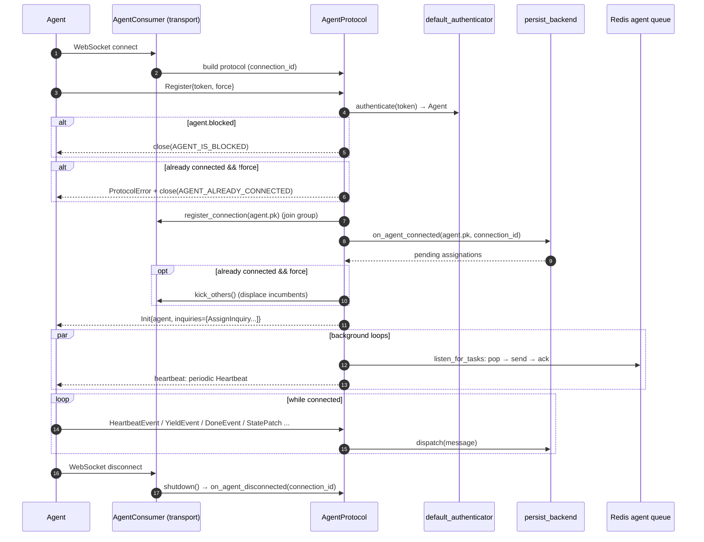

# Agent Protocol: the WebSocket wire protocol

Agents connect to Rekuest over a WebSocket at `/agi` and hold a long-lived, stateful conversation:
register, prove identity, receive work, stream results, answer heartbeats. This document describes
that protocol, the **humble-object** design that makes it testable, the single-live-connection
guarantee, and the at-least-once delivery queue.

Key files: `facade/consumers/agent_protocol.py` (the protocol), `async_consumer.py` (the Channels
adapter), `agent_queue.py` (the delivery queue), `facade/persist_backend.py` (the backend port),
`facade/messages.py` (the message catalogue).

## The humble-object design

The conversation logic lives in `AgentProtocol` — a **plain object with injected dependencies that
knows nothing about Django Channels or WebSockets**. The transport (`send`, `close`), the message
`queue`, the `backend` port (`persist_backend`), the `authenticator`, and the group hooks
(`register_connection`, `kick_others`) are all injected. Because every collaborator is injected, the
whole protocol/lifecycle/heartbeat behaviour is unit-testable with fakes — no docker, no DB, no
monkeypatching.

`AgentConsumer` (`async_consumer.py`) is the thin Channels adapter: on `connect` it accepts the
socket, mints a `connection_id`, and builds an `AgentProtocol` whose `send`/`close` close over the
WebSocket and whose `queue` is a `RedisAgentQueue`. `receive` forwards frames to the protocol;
`disconnect` calls `protocol.shutdown()`.

## Connect → register → run

### First frame must be `Register`

`receive` enforces that the first validated frame is a `messages.Register`; anything else closes the
socket. Frames are parsed and validated through a discriminated-union pydantic model
(`FromAgentPayload`), so malformed JSON or schema-mismatched frames are rejected with a specific
close code (`codes.py`).

### Authentication

`default_authenticator` expands the register token into `(client, user, organization)` and does
`Agent.objects.aget_or_create(client=, user=, organization=, defaults=dict(name=client.client_id))`.

> **Pinned behaviour:** the create-branch omits the required `app`/`release`/`device` columns, so
> this can only *find* an agent that was already created out-of-band by the `ensureAgent` mutation.
> Registering for an uncreated agent is rejected (guarded by
> `test_register_for_uncreated_agent_is_rejected`). The authenticator is injected, so deployments can
> swap it.

A `blocked` agent is closed immediately after authentication.

### Init + background loops

On successful register the protocol sends an `Init` carrying the agent id and an `AssignInquiry`
per pending assignation (work that was queued/unfinished while it was away — returned by
`on_agent_connected`). It then spawns two background tasks:

- **`listen_for_tasks`** — relays queued work to the agent (see delivery below).
- **`heartbeat`** — liveness (see below).

All outbound frames funnel through a single `_send` guarded by an `asyncio.Lock`, because the
heartbeat loop, the listen loop, and `receive` can all try to send concurrently on the same event
loop; without serialization their frames could interleave on the wire. `close` deliberately stays
outside the lock (and is never called while it is held) to avoid deadlock.

## Single live connection per agent

Only one connection may own an agent at a time. The mechanism is the agent's
`active_connection_id` plus a Channels group (`agent-{id}`):

1. On register, if the agent is already `connected` and the new register did **not** set `force`,
   the new connection is rejected with `AGENT_ALREADY_CONNECTED`.
2. With `force`, the new connection **joins the group first**, then `on_agent_connected` claims
   ownership by writing `active_connection_id = <new connection_id>`, and only *then* `kick_others()`
   does a `group_send` telling every other connection to close (`agent_displace` → close with
   `AGENT_REPLACED`, skipping the initiator).

The ordering is the whole point: ownership is claimed **before** displacing the incumbent. The
displaced connection's `on_agent_disconnected` is guarded — if `active_connection_id` no longer
points at it, it does **nothing** (does not flip `connected` off, does not mark assignations
disconnected), because the new owner is authoritative. This prevents a departing stale connection
from clobbering the live one's state.

## Heartbeats

`heartbeat` loops: sleep `AGENT_HEARTBEAT_INTERVAL`, arm a fresh future, send `Heartbeat`, then
`wait_for` the answer within `AGENT_HEARTBEAT_RESPONSE_TIMEOUT`. A timeout closes the socket
(`HEARTBEAT_NOT_RESPONDED`). When the agent answers, `on_agent_heartbeat` resolves the future
**before** persisting `connected`/`last_seen` — the DB write is a round-trip, and doing it first
could push resolution past the timeout and wrongly close a connection that actually answered.

## Task delivery — the agent queue (at-least-once)

The backend→agent path is a hand-rolled Redis queue (`agent_queue.py`), **not** the Channels layer,
on purpose: a message pushed while the agent is briefly offline persists in Redis and survives
reconnect, whereas a `group_send` to an empty group would be dropped.

- **Producer:** `AgentConsumer.broadcast(agent_id, message)` (called from backend/signal code)
  pushes the serialized message with `lpush` onto `{agent_id}_my_queue`, reusing a pooled sync Redis
  connection.
- **Consumer:** `listen_for_tasks` calls `queue.pop`, which uses `blmove` to atomically move the
  message into a per-agent processing list `{agent_id}_processing` (it stays there), then the
  protocol **delivers first, then `ack`s** (`lrem` from the processing list).

The send-then-ack ordering gives **at-least-once** semantics: a crash between `pop` and `ack` leaves
the message in the processing list, recoverable rather than lost. The queue is an abstract port
(`AgentQueue`) with a `RedisAgentQueue` for real deployments and an `InMemoryAgentQueue` for unit
tests.

## Message catalogue

Messages are split by direction (`facade/messages.py`):

**Server → agent (`ToAgentMessage`)** — `Init`, `Assign`, `Cancel`, `Interrupt`, `Bounce`, `Kick`,
`Collect`, `Heartbeat`, `ProtocolError`, and inquiries (`AssignInquiry`).

**Agent → server (`FromAgentMessage`)**, dispatched in `AgentProtocol.dispatch` to the backend:

| Message | Handler | Effect |
| --- | --- | --- |
| `HeartbeatEvent` | `on_agent_heartbeat` | liveness ack |
| `ProgressEvent` | `on_agent_progress` | `AssignationEvent(PROGRESS)` |
| `LogEvent` | `on_agent_log` | `AssignationEvent(LOG)` |
| `YieldEvent` | `on_agent_yield` | `AssignationEvent(YIELD, returns)` + higher-order unfold |
| `DoneEvent` | `on_agent_done` | terminal: `is_done`, `finished_at` |
| `CancelledEvent` | `on_agent_cancelled` | terminal |
| `ErrorEvent` / `CriticalEvent` | `on_agent_error` / `on_agent_critical` | terminal with message |
| `StatePatchEvent` | `on_agent_state_patch` | append a `Patch` |
| `StateSnapshotEvent` | `on_agent_state_snapshot` | write `Snapshot`s |
| `SessionInitMessage` | `on_agent_session_init` | initialize a `Session` |

A second `Register` after registration is a protocol violation — it must not re-run `on_register`
(that would orphan the first listen/heartbeat pair); it falls through to the catch-all and closes.

## Shutdown

`AgentProtocol.shutdown` (called from the consumer's `disconnect`) cancels the listen and heartbeat
tasks, calls `on_agent_disconnected(agent.pk, connection_id)` (which no-ops if displaced), and closes
the queue connection. The persisted disconnect marks the agent offline and flags its still-running
assignations `DISCONNECTED` — see [assignation-lifecycle.md](assignation-lifecycle.md).
