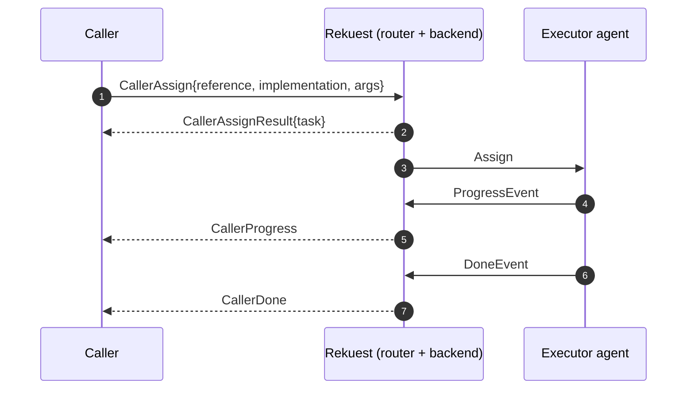
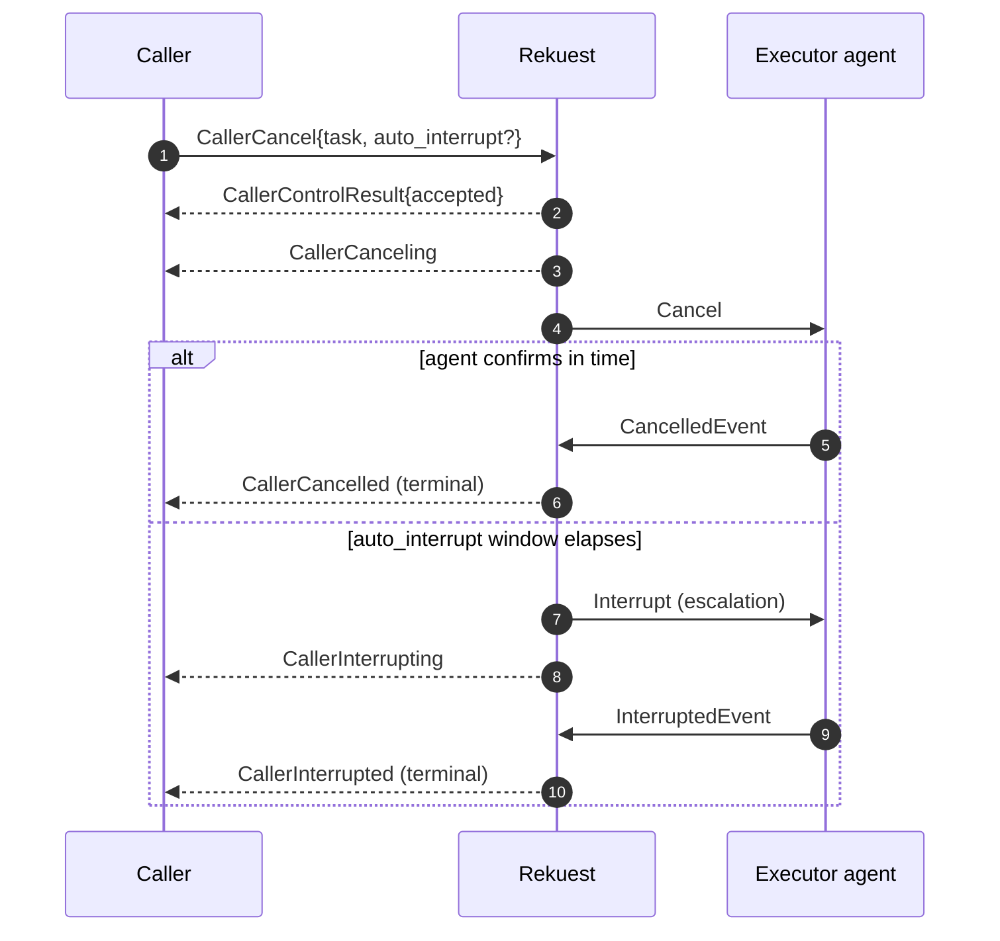

# Caller Protocol: originating & controlling work over the socket

A **caller** is a participant that *requests* work rather than executing it. Historically a caller
only ever talked GraphQL (`assign` mutation + an `TaskEvent` subscription). The unified `/agi`
protocol now lets a caller do the whole job over the **same WebSocket an agent uses**: originate
tasks, drive their lifecycle (cancel / interrupt / pause / resume), and observe the resulting
events streamed back as `Caller*` mirrors — no GraphQL required. This document is the caller's side
of the wire: **what you send, what you get back.**

It is the companion to [agent-protocol.md](agent-protocol.md) (the *executor* side — same socket,
same framing, same humble-object design). Read that first for connect/register/heartbeat mechanics;
this doc only covers what is caller-specific.

Key files: `facade/messages.py` (the message catalogue), `facade/capabilities.py` (capability gating),
`facade/message_router.py` (`route_from_agent_message`, the shared dispatcher),
`facade/caller_events.py` (`build_caller_message`, the mirror mapping), `facade/http_intake.py`
(the server-to-server HTTP path).

## One protocol, four roles

There is a single protocol; what a participant may do is gated by **capabilities** carried in its
token, requested via a **mode** on `Register`.

Two independent capability axes (`facade/capabilities.py`), derived from token scopes:

| Capability | Token scope | Grants |
| --- | --- | --- |
| `executes_work` | `rekuest:execute` | runs tasks (the executor singleton — one live connection per agent) |
| `can_assign_root` | `rekuest:assign_root` | originates **root** (parentless) tasks |

`AgentMode` (`facade/messages.py`) is the role a participant requests; it is granted only if the
token carries the matching scopes (`authorize_mode`), else the socket closes with
`MODE_NOT_AUTHORIZED_CODE` (4006):

| Mode | executes_work | can_assign_root | Who |
| --- | --- | --- | --- |
| `EXECUTOR` | ✓ | ✗ | an app runtime that runs work |
| `CALLER` | ✗ | ✓ | a frontend / orchestrator that only requests work |
| `ORCHESTRATOR` | ✓ | ✓ | runs work *and* originates roots |
| `OBSERVER` | ✗ | ✗ | a read-only dashboard that only streams events |

> **Rollout safety:** enforcement is opt-in (`REKUEST_CAPABILITIES.ENFORCE`, default off). While off,
> every token resolves to **full** capabilities, so existing clients that predate the scopes keep
> working. Turn `ENFORCE` on once your tokens carry the scopes.

A caller registers as **`CALLER`** (or **`ORCHESTRATOR`** if it also executes work).

## 1. Connect & register

The first frame must be a `Register` (anything else closes the socket):

```jsonc
{ "type": "REGISTER", "token": "<jwt>", "mode": "CALLER" }
```

| Field | For a caller |
| --- | --- |
| `token` | required — authenticates and resolves the `(client, user, organization)` identity |
| `mode` | `CALLER` or `ORCHESTRATOR` (default is `EXECUTOR`) |
| `force` | **executor-only** — a non-executor never force-displaces other connections; omit |
| `session_id` | **executor-only** — the reclaim signal for in-flight work; omit |

The server replies with `Init{ agent, inquiries }` — `agent` is your Agent id; `inquiries` is empty
for a pure caller (it lists pending work for executors). After `Init` you may start sending
`CallerAssign` / lifecycle requests.

## 2. Originate work — `CallerAssign`

`CallerAssign` is the socket equivalent of the GraphQL `assign` mutation (fields mirror
`facade/inputs.AssignInputModel`):

```jsonc
{
  "type": "CALLER_ASSIGN",
  "reference": "my-stable-key-1",      // idempotency key (see below)
  "implementation": "42",               // one targeting option (see table)
  "args": { "x": 1 }
}
```

| Field | Meaning |
| --- | --- |
| `reference` | **Idempotency key**, stable for a logical request. A resend (e.g. after reconnect) returns the *same* task with `created=false` rather than creating a duplicate. |
| `args` | The input ports → values map. |
| `action` / `action_hash` / `implementation` / `agent`+`interface` | **Targeting** — pick one: assign by action (the backend routes to a providing agent), by action hash, by a direct implementation id, or directly to an agent+interface. |
| `parent` | The parent task id. **`None` = a root**, which requires `can_assign_root`. Set it for a dependent. |
| `dependency` / `method` / `resolution` | Resolve a dependency when running inside a resolved task. |
| `step` / `capture` / `ephemeral` / `hooks` | Stop at first breakpoint / debug-capture mode / ephemeral / lifecycle hooks. |

**Reply — `CallerAssignResult`:**

```jsonc
{ "type": "CALLER_ASSIGN_RESULT", "request": "<CallerAssign.id>",
  "reference": "my-stable-key-1", "task": "1234", "created": true, "error": null }
```

- `request` echoes the originating `CallerAssign.id`; `reference` echoes your idempotency key — use
  either to correlate the reply with your request **before** any task events arrive (those are
  keyed only by `task` id).
- `task` is the durable id you will key all subsequent mirrors on.
- `created=false` means a duplicate `reference` returned the existing task.
- A bad request **NACKs** (`task=null`, `error` set, e.g. *missing can_assign_root*) — it
  **never tears down the socket**.

## 3. Drive the lifecycle (two-phase)

A caller controls tasks **it originated** (ownership is the gate — controlling another
caller's work is rejected). Every control op is **two-phase**:

1. You send the request → the backend records a `-ING` event (you see a `Caller*ing` mirror) and
   broadcasts a control message to the *executing* agent. You get a `CallerControlResult` ack.
2. The executing agent confirms with an event → the backend records the resolved `-ED` event (you
   see the `Caller*ed` mirror).

The op **resolves only on the agent's confirmation** — a request alone is not terminal.

| You send | Forwarded to the agent as | Confirmed by | Resolves to | Terminal? |
| --- | --- | --- | --- | --- |
| `CallerCancel{ task, auto_interrupt? }` | `Cancel` (mother only) | `CancelledEvent` | `CANCELLED` | yes |
| `CallerInterrupt{ task }` | `Interrupt` (**all children**) | `InterruptedEvent` | `INTERUPTED` | yes |
| `CallerPause{ task }` | `Pause` | `PausedEvent` | `PAUSED` | no (suspended) |
| `CallerResume{ task, step? }` | `Resume` | `ResumedEvent` | `RESUMED` | no (running) |

**Ack — `CallerControlResult`:**

```jsonc
{ "type": "CALLER_CONTROL_RESULT", "request": "<request.id>",
  "task": "1234", "accepted": true, "error": null }
```

`accepted=true` means the request was persisted + broadcast; `accepted=false` (with `error`) means
it was rejected — not owned by you, unknown, or already terminal — again **without** closing the
socket. The *outcome* (CANCELLED / PAUSED / …) arrives later as a `Caller*` mirror, not in this ack.

**Cancel vs interrupt.** `cancel` is the *nice* path — sent only to the mother, which winds its own
children down. `interrupt` is *forceful* — propagated to every still-running descendant. Both are
two-phase: a silent agent is not force-killed by either.

**`auto_interrupt`** (on `CallerCancel`, seconds, default `None`): if the cancel is not confirmed
within the window, the backend auto-escalates to an interrupt on the same task. `None`
disables escalation — the cancel then stays pending (`CANCELING`) until the agent confirms or you
escalate manually by sending a `CallerInterrupt`.

**`step`** (on `CallerResume`): `step=true` resumes only to the next breakpoint (the equivalent of
the former standalone "step" instruction); `step=false` runs on freely.

## 4. Observe results — the `Caller*` mirror stream

Every `TaskEvent` for an task you originated is streamed back as a `Caller*` message
(`facade/caller_events.py:build_caller_message` maps each `TaskEventKind` → its mirror class):

| Phase | Mirrors |
| --- | --- |
| dispatch / progress | `CallerBound`, `CallerQueued`, `CallerAssigned`, `CallerProgress`, `CallerDelegate`, `CallerLog`, `CallerYield` |
| cancel / interrupt | `CallerCanceling` → `CallerCancelled`, `CallerInterrupting` → `CallerInterrupted` |
| pause / resume | `CallerPausing` → `CallerPaused`, `CallerResuming` → `CallerResumed` |
| terminal | `CallerDone`, `CallerError`, `CallerCritical`, `CallerDisconnected` |

Every mirror carries (`CallerEvent` base):

- `task` — the correlation key you learned from `CallerAssignResult`.
- `event` — the originating `TaskEvent` id (a stable dedup handle).
- `seq` — its monotonic PK (an ordering / gap-detection key).

**Delivery is best-effort.** Mirrors are fanned out over the `ass_caller_{caller_id}` channel-layer
group (see [realtime.md](realtime.md)). On a brief disconnect, events emitted while you were away are
**missed** — the durable source of truth is the persisted `TaskEvent` log, which you can read
back via GraphQL. Use `seq` to detect gaps.





## 5. Server-to-server callers (HTTP intake)

A caller without a persistent socket (another service) can use the HTTP intake at
**`POST agi/http/<agent_id>`** (`facade/http_intake.py`, `rekuest/urls.py`). The body is the same
FromAgent message JSON; it must be HMAC-signed with the agent's `hook_url_secret` in the
`X-Rekuest-Signature` header (`facade/hooks.py`). The request is verified, parsed
(`FromAgentPayload`), and routed through the **same** `route_from_agent_message` the socket uses — so
`CallerAssign` / `CallerCancel` / … behave identically. The reply (`CallerAssignResult` /
`CallerControlResult`) is returned in the **HTTP response** instead of over a socket. Such a caller
that is itself a webhook agent receives its `Caller*` mirrors as signed POSTs to its `hook_url`.

## Quick reference — what the caller sends

| Send (FromAgent) | Get back (ToAgent) | Then observe (mirrors) |
| --- | --- | --- |
| `Register{token, mode: CALLER}` | `Init{agent}` | — |
| `CallerAssign{reference, …targeting…, args}` | `CallerAssignResult{task, created, error}` | `CallerBound/Queued/Assigned/Progress/Yield/Log/…` then `CallerDone/Error/Critical` |
| `CallerCancel{task, auto_interrupt?}` | `CallerControlResult{accepted, error}` | `CallerCanceling` → `CallerCancelled` (or escalated → `CallerInterrupted`) |
| `CallerInterrupt{task}` | `CallerControlResult` | `CallerInterrupting` → `CallerInterrupted` |
| `CallerPause{task}` | `CallerControlResult` | `CallerPausing` → `CallerPaused` |
| `CallerResume{task, step?}` | `CallerControlResult` | `CallerResuming` → `CallerResumed` |

## See also

- [agent-protocol.md](agent-protocol.md) — the executor side of the same socket.
- [task-lifecycle.md](task-lifecycle.md) — the Task event state machine.
- [realtime.md](realtime.md) — the `ass_caller_{id}` fan-out the mirrors ride on.
- [identity.md](identity.md) — the Caller identity and ownership.
