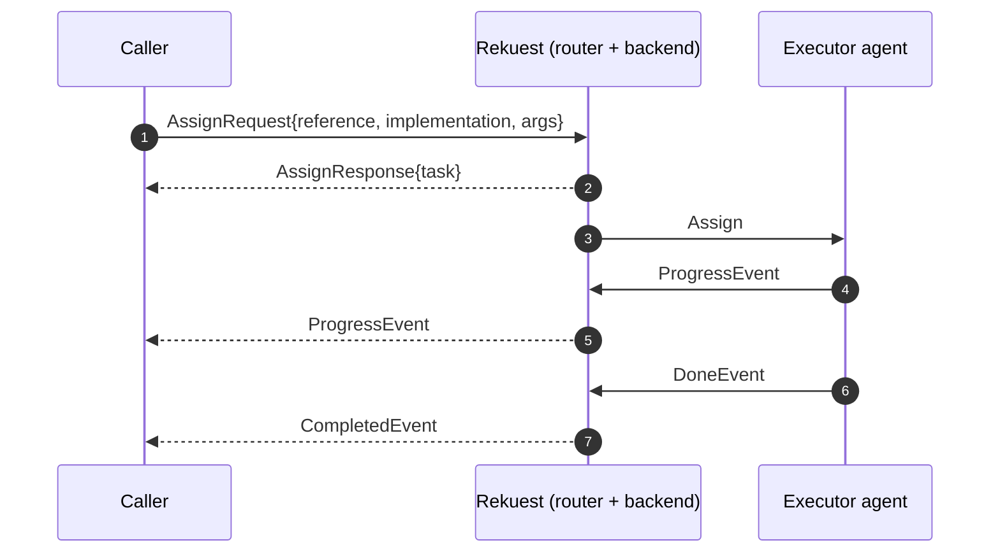
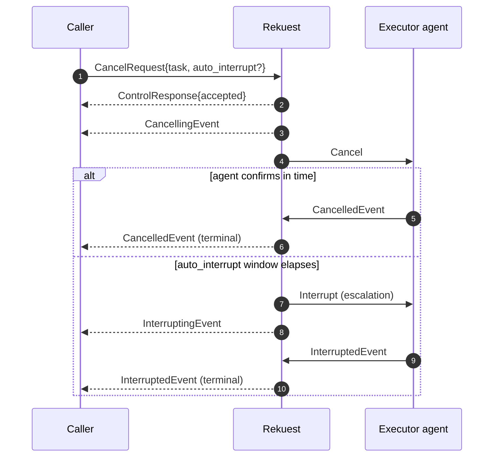

# Sub-assignment: assigning & controlling dependent work over the socket

An agent running a task often needs to hand part of the job to another implementation. It does that
over the **same WebSocket it registered on**: assign a child task, drive its lifecycle
(cancel / interrupt / pause / resume), and observe the resulting events streamed back as `…Event`
mirrors. This document is that side of the wire: **what you send, what you get back.**

> **Roots are not assignable here.** Every socket assign must carry a `parent`. A root task must
> trace to an accountable human, so roots originate solely from the GraphQL `assign` mutation — see
> the human-root invariant in [provenance.md](provenance.md). There is no longer a caller/observer
> connection mode or a capability layer: everyone on `/agi` is an agent.

It is the companion to [agent-protocol.md](agent-protocol.md) (the execution side — same socket,
same framing, same humble-object design). Read that first for connect/register/heartbeat mechanics;
this doc only covers sub-assignment.

Key files: `facade/messages.py` (the message catalogue),
`facade/message_router.py` (`route_from_agent_message`, the shared dispatcher),
`facade/caller_events.py` (the mirror mapping), `facade/http_intake.py`
(the server-to-server HTTP path).

## 1. Connect & register

The first frame must be a `Register` (anything else closes the socket):

```jsonc
{ "type": "REGISTER", "token": "<jwt>", "session_id": "<per-process id>" }
```

| Field | Meaning |
| --- | --- |
| `token` | required — authenticates and resolves the `(client, user, organization)` identity |
| `force` | take over the agent's existing live connection (the singleton rule) |
| `session_id` | the per-process reclaim signal for in-flight work |

`Register` **rejects unknown fields**: it used to carry a `mode`, and a stale client sending one
must be told to update rather than be silently admitted (see [agent-protocol.md](agent-protocol.md)).

The server replies with `Init{ agent, inquiries }` — `agent` is your Agent id; `inquiries` lists
work that was left pending while you were away. After `Init` you may start sending assign and
lifecycle requests.

## 2. Assign dependent work — `AssignRequest`

`AssignRequest` is the socket sibling of the GraphQL `assign` mutation, restricted to *child*
tasks (fields mirror `facade/inputs.AssignInputModel`):

```jsonc
{
  "type": "ASSIGN_REQUEST",
  "reference": "my-stable-key-1",      // idempotency key (see below)
  "parent": "1200",                     // REQUIRED — the task you are running
  "implementation": "42",               // one targeting option (see table)
  "args": { "x": 1 }
}
```

| Field | Meaning |
| --- | --- |
| `reference` | **Idempotency key**, stable for a logical request. A resend (e.g. after reconnect) returns the *same* task with `created=false` rather than creating a duplicate. |
| `args` | The input ports → values map. |
| `action` / `action_hash` / `implementation` / `agent`+`interface` | **Targeting** — pick one: assign by action (the backend routes to a providing agent), by action hash, by a direct implementation id, or directly to an agent+interface. |
| `parent` | The parent task id — **required**. Omitting it is a parentless (root) assign and is refused: roots come only from the GraphQL `assign` mutation. |
| `dependency` / `method` / `resolution` | Resolve a dependency when running inside a resolved task. |
| `step` / `capture` / `hooks` | Stop at first breakpoint / debug-capture mode / lifecycle hooks. |

**Reply — `AssignResponse`:**

```jsonc
{ "type": "ASSIGN_RESPONSE", "request": "<AssignRequest.id>",
  "reference": "my-stable-key-1", "task": "1234", "created": true, "error": null }
```

- `request` echoes the originating `AssignRequest.id`; `reference` echoes your idempotency key — use
  either to correlate the reply with your request **before** any task events arrive (those are
  keyed only by `task` id).
- `task` is the durable id you will key all subsequent mirrors on.
- `created=false` means a duplicate `reference` returned the existing task.
- A bad request **NACKs** (`task=null`, `error` set — e.g. a missing `parent`) — it
  **never tears down the socket**, which would kill the agent's other work.

## 3. Drive the lifecycle (two-phase)

An agent controls tasks **it assigned** (ownership is the gate — controlling another caller's
work is rejected). Every control op is **two-phase**:

1. You send the request → the backend records a `-ING` event (you see a `…ingEvent` mirror) and
   broadcasts a control message to the *executing* agent. You get a `ControlResponse` ack.
2. The executing agent confirms with an event → the backend records the resolved `-ED` event (you
   see the `…edEvent` mirror).

The op **resolves only on the agent's confirmation** — a request alone is not terminal.

| You send | Forwarded to the agent as | Confirmed by | Resolves to | Terminal? |
| --- | --- | --- | --- | --- |
| `CancelRequest{ task, auto_interrupt? }` | `Cancel` (mother only) | `CancelledEvent` | `CANCELLED` | yes |
| `InterruptRequest{ task }` | `Interrupt` (**all children**) | `InterruptedEvent` | `INTERUPTED` | yes |
| `PauseRequest{ task }` | `Pause` | `PausedEvent` | `PAUSED` | no (suspended) |
| `ResumeRequest{ task, step? }` | `Resume` | `ResumedEvent` | `RESUMED` | no (running) |

**Ack — `ControlResponse`:**

```jsonc
{ "type": "CALLER_CONTROL_RESULT", "request": "<request.id>",
  "task": "1234", "accepted": true, "error": null }
```

`accepted=true` means the request was persisted + broadcast; `accepted=false` (with `error`) means
it was rejected — not owned by you, unknown, or already terminal — again **without** closing the
socket. The *outcome* (CANCELLED / PAUSED / …) arrives later as a `…Event` mirror, not in this ack.

**Cancel vs interrupt.** `cancel` is the *nice* path — sent only to the mother, which winds its own
children down. `interrupt` is *forceful* — propagated to every still-running descendant. Both are
two-phase: a silent agent is not force-killed by either.

**`auto_interrupt`** (on `CancelRequest`, seconds, default `None`): if the cancel is not confirmed
within the window, the backend auto-escalates to an interrupt on the same task. `None`
disables escalation — the cancel then stays pending (`CANCELING`) until the agent confirms or you
escalate manually by sending a `InterruptRequest`.

**`step`** (on `ResumeRequest`): `step=true` resumes only to the next breakpoint (the equivalent of
the former standalone "step" instruction); `step=false` runs on freely.

## 4. Observe results — the `…Event` mirror stream

Every `TaskEvent` for a task you assigned is streamed back as an `…Event` message
(`facade/caller_events.py:build_caller_message` maps each `TaskEventKind` → its mirror class):

| Phase | Mirrors |
| --- | --- |
| dispatch / progress | `BoundEvent`, `QueuedEvent`, `StartedEvent`, `ProgressEvent`, `DelegateEvent`, `LogEvent`, `YieldEvent` |
| cancel / interrupt | `CancellingEvent` → `CancelledEvent`, `InterruptingEvent` → `InterruptedEvent` |
| pause / resume | `PausingEvent` → `PausedEvent`, `ResumingEvent` → `ResumedEvent` |
| terminal | `CompletedEvent`, `FailedEvent`, `CriticalEvent`, `DisconnectedEvent` |

Every mirror carries (`ExecutionEvent` base):

- `task` — the correlation key you learned from `AssignResponse`.
- `event` — the originating `TaskEvent` id (a stable dedup handle).
- `seq` — its monotonic PK (an ordering / gap-detection key).

**Delivery is best-effort.** Mirrors are fanned out over the `ass_caller_{caller_id}` channel-layer
group (see [realtime.md](realtime.md)). On a brief disconnect, events emitted while you were away are
**missed** — the durable source of truth is the persisted `TaskEvent` log, which you can read
back via GraphQL. Use `seq` to detect gaps.


```mermaid
sequenceDiagram
    autonumber
    participant C as Caller
    participant R as Rekuest (router + backend)
    participant E as Executor agent
    C->>R: AssignRequest{reference, implementation, args}
    R-->>C: AssignResponse{task}
    R->>E: Assign
    E->>R: ProgressEvent
    R-->>C: ProgressEvent
    E->>R: DoneEvent
    R-->>C: CompletedEvent
```


```mermaid
sequenceDiagram
    autonumber
    participant C as Caller
    participant R as Rekuest
    participant E as Executor agent
    C->>R: CancelRequest{task, auto_interrupt?}
    R-->>C: ControlResponse{accepted}
    R-->>C: CancellingEvent
    R->>E: Cancel
    alt agent confirms in time
        E->>R: CancelledEvent
        R-->>C: CancelledEvent (terminal)
    else auto_interrupt window elapses
        R->>E: Interrupt (escalation)
        R-->>C: InterruptingEvent
        E->>R: InterruptedEvent
        R-->>C: InterruptedEvent (terminal)
    end
```

## 5. Server-to-server callers (HTTP intake)

An agent without a persistent socket (a HookAgent / another service) can use the HTTP intake at
**`POST agi/http/<agent_id>`** (`facade/http_intake.py`, `rekuest/urls.py`). The body is the same
FromAgent message JSON; it must be HMAC-signed with the agent's `hook_url_secret` in the
`X-Rekuest-Signature` header (`facade/hooks.py`). The request is verified, parsed
(`FromAgentPayload`), and routed through the **same** `route_from_agent_message` the socket uses — so
`AssignRequest` / `CancelRequest` / … behave identically. The reply (`AssignResponse` /
`ControlResponse`) is returned in the **HTTP response** instead of over a socket. Such a caller
that is itself a webhook agent receives its `…Event` mirrors as signed POSTs to its `hook_url`.

## Quick reference — what the caller sends

| Send (FromAgent) | Get back (ToAgent) | Then observe (mirrors) |
| --- | --- | --- |
| `Register{token, session_id}` | `Init{agent, inquiries}` | — |
| `AssignRequest{reference, parent, …targeting…, args}` | `AssignResponse{task, created, error}` | `BoundEvent/Queued/Assigned/Progress/Yield/Log/…` then `CompletedEvent/Error/Critical` |
| `CancelRequest{task, auto_interrupt?}` | `ControlResponse{accepted, error}` | `CancellingEvent` → `CancelledEvent` (or escalated → `InterruptedEvent`) |
| `InterruptRequest{task}` | `ControlResponse` | `InterruptingEvent` → `InterruptedEvent` |
| `PauseRequest{task}` | `ControlResponse` | `PausingEvent` → `PausedEvent` |
| `ResumeRequest{task, step?}` | `ControlResponse` | `ResumingEvent` → `ResumedEvent` |

## See also

- [agent-protocol.md](agent-protocol.md) — registration, liveness and execution on the same socket.
- [task-lifecycle.md](task-lifecycle.md) — the Task event state machine.
- [realtime.md](realtime.md) — the `ass_caller_{id}` fan-out the mirrors ride on.
- [identity.md](identity.md) — the Caller identity and ownership.

## Probes over the socket

`PROBE_REQUEST` fires an ephemeral probe under the requesting agent's own identity
(the socket twin of the GraphQL `probe` mutation); the backend answers with
`PROBE_RESPONSE` (`probe` id or `error`). The probe's events then stream back as the
usual `…Event` mirrors whose `task` is the `p-…` probe id and whose `event`/`seq` come
from the per-probe counter. Probe frames (Assign/Cancel/Pause/Resume) ride a priority
lane: they jump the agent's queued task backlog and are LIFO among themselves.
