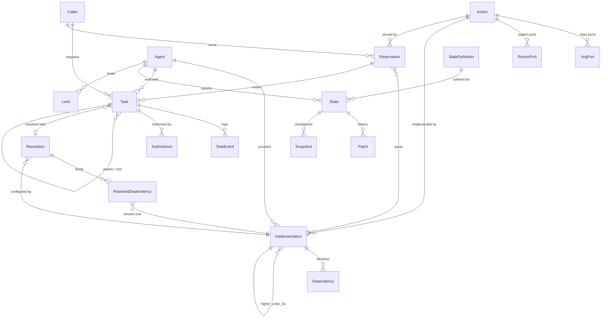

# Domain Model

This document maps the core data model in `facade/models/`. It is organised around the request
flow — identity → catalogue → provisioning → execution → state — and ends with the uniqueness
rules that encode most of the business logic.

> Identity (`Caller` / `Agent`) is covered in depth in [identity.md](identity.md); this document
> shows how the rest of the graph hangs off it.

## Entity-relationship diagram (core graph)

## 1. Identity layer

| Model | Purpose |
| --- | --- |
| `Caller` | The `(client, user, organization)` requestor identity. Owns `Task`/`Reservation`. |
| `Agent` | The provider runtime: same triple + `app`/`release`/`device` + connection state. |

See [identity.md](identity.md). The rest of the graph attaches to one of these two.

## 2. Catalogue layer — Action and ports

**`Action`** (`facade/models/action.py`) is the abstract, versioned **function contract** — an
interface, independent of who implements it. Key fields:

- `app`, `key`, `version`, `organization` — identity of the contract.
- `hash` — digest over the whole spec (args, returns, metadata); used to detect changes and to
  look an action up by signature.
- `kind` — `FUNCTION` (one result) or `GENERATOR` (a stream of yields).
- `pure` / `idempotent` / `stateful` — execution semantics (cacheable, safe to retry, touches
  physical state).
- `args` / `returns` (JSONB) — the legacy serialized port lists.
- `arg_count` / `return_count` — pre-computed root-port counts (a matching optimization).

**`ArgPort` / `ReturnPort`** are the *relational* representation of those ports — one row per port,
flattened out of the JSONB so they can be queried with SQL. Both share a base shape:

| Field | Role |
| --- | --- |
| `index` | Position in the port list. |
| `key` | Local name (e.g. `mask`). |
| `key_path` | Materialized dotted path (e.g. `options.advanced.mask`) — O(1) nested lookup. |
| `kind` | Structural type (`INT`, `STRING`, `LIST`, `DICT`, `STRUCTURE`, …). |
| `identifier` | Macro-type / port class (e.g. `@mikro/image`) — type-compatibility matching. |
| `compiled_jsonpath` | Compiled `requires`/`provides` micro-constraint (see [action-matching.md](action-matching.md)). |
| `nullable` | Whether NULL is accepted. |
| `parent` (self-FK) | If nested in a `LIST`/`DICT`, the parent port — enables unbounded nesting. |

These tables (`facade_argport`, `facade_returnport`) and their indexes are the foundation of the
relational matching engine — that whole story is [action-matching.md](action-matching.md).

## 3. Provisioning layer — Implementation, Dependency, Resolution

**`Implementation`** (`facade/models/implementation.py`) binds an **Action to an Agent**: "this
agent can run this action, via this `interface`". Key fields: `action`, `agent`, `release`,
`interface`, `params` (bound overrides), `dynamic` (may create reservations at runtime),
`manipulates` (M2M to `State`), and the higher-order pair `higher_order_for` /
`higher_order_config` (see [higher-order.md](higher-order.md)).

**`Dependency`** declares what an implementation *needs* to run (other actions/states), with an
`assign_policy`, `app_filter`/`version_filter`, viability counts (`min`/`max`/`prefered_instances`)
and an `auto_resolvable` flag.

**`Resolution` + `ResolvedDependency`** are a **binding tree**: a `Resolution` configures an
implementation's dependencies, each `ResolvedDependency` picks a concrete `Implementation` to
satisfy one dependency, and `down_stream_resolution` recurses for that implementation's *own*
dependencies. Resolutions can be named templates (`is_template`) for reuse.

## 4. Routing layer — Reservation

**`Reservation`** (`facade/models/reservation.py`) is a **standing pool**: a durable channel that
pre-binds a set of `implementations` for an `action`, owned by a `caller`. Assignments submitted to
a reservation are routed to one of its implementations by a `strategy`
(`RANDOM`, `ROUND_ROBIN`, `LEAST_BUSY`, `LEAST_TIME`, `LEAST_LOAD`, `DIRECT`). It records
`saved_args` (defaults), `binds` (routing config) and provenance (`causing_task`,
`causing_dependency`). Reservations are optional — a caller can also assign directly to an action
or implementation without one.

## 5. Execution layer — Task and its events

**`Task`** (`facade/models/task.py`) is the **central execution log** — one row per
task run, tracking it from assignment to completion. The fields that matter most:

| Field | Role |
| --- | --- |
| `action` | The contract being run. |
| `implementation` (nullable) | Currently-bound implementation (can be reassigned). |
| `agent` | Who executes it. |
| `caller` (nullable) | Who requested it (the realtime routing key). |
| `reservation` (nullable) | The pool it came from, if any. |
| `resolution` (nullable) | Dependency resolution used. |
| `parent` / `root` (self-FKs) | Task chains — `parent` is the immediate creator, `root` the top. |
| `args` / `dependencies` (JSON) | Inputs and the resolved dependency tree. |
| `acted_on` (array) | Structures this task modified (provenance). |
| `latest_event_kind` / `latest_instruct_kind` | Denormalized "current state" for fast reads. |
| `is_done`, `finished_at` | Terminal markers. |
| `ephemeral` | Delete after completion vs. keep for audit. |

**`TaskEvent`** is the immutable per-transition log entry the agent (or server) appends:
`kind` (see the lifecycle in [task-lifecycle.md](task-lifecycle.md)), optional
`returns` (for `YIELD`), `progress`, `message`, `level`, and `delegated_to` (used by higher-order
unfolding).

**`TaskInstruct`** is a command directed *at* a running task by a `caller`
(`ASSIGN`, `CANCEL`, `STEP`, `RESUME`, `PAUSE`, `INTERRUPT`, `COLLECT`).

**`AgentEvent`** is the agent-lifecycle analogue (`CONNECT`/`DISCONNECT`), separate from task
events.

**`Lock`** (in `agent.py`) is a per-agent mutual-exclusion key, optionally `hold_by` an
`Task`.

## 6. State layer

Agents can expose structured, evolving state:

- **`StateDefinition`** — the schema (`name`, `hash`, `ports`) for a kind of state.
- **`State`** — the current value for one `(interface, agent)` against a `definition`, with a
  `retention_policy` controlling how much history is kept.
- **`Patch`** — an incremental JSON-Patch change (`op`/`path`/`value`) with a `global_rev` revision
  counter and the `task` that caused it (causality).
- **`Snapshot`** — a full-value checkpoint at a `global_rev`.
- **`Session`** — a session boundary within an agent's state lifecycle.

State changes fan out over `patches_state_{id}` / `patches_agent_{id}`; see [realtime.md](realtime.md).

## 7. Catalogue metadata & extras

Supporting models round out the catalogue: `Collection` / `Protocol` (groupings and behaviour
contracts on Actions), `Structure` / `Interface` / `Descriptor` / `StructurePackage` (the type
system ports reference), `Toolbox` / `Shortcut` (saved task configs), `TestCase` / `TestResult`,
the `Blok` / `Dashboard` UI models, and the agent `Shelve`/`Drawer` storage (`FilesystemShelve`,
`MemoryShelve`, and their drawers) for inter-task data.

## Uniqueness & cardinality (the encoded business rules)

| Model | Constraint | Why it exists |
| --- | --- | --- |
| `Caller` | unique `(client, user, organization)` | One requestor identity per auth context. |
| `Agent` | unique `(client, user, organization)` | One provider identity per auth context. |
| `Action` | unique `(organization, app, key, version)` | Versioned catalogue per tenant. |
| `Implementation` | unique `(action, agent)` | An agent implements an action at most once. |
| `Implementation` | unique `(interface, agent)` | An agent's interface name is unique to it. |
| `State` | unique `(interface, agent)` | One state per interface per agent. |
| `StateDefinition` | unique `hash` | Deduplicated state schemas. |
| `Structure` / `Interface` / `Descriptor` | unique `(package, key)` | Package-scoped type keys. |
| `TestCase` | unique `(action, tester)` | One test per action/tester pair. |

These constraints are not incidental — they are the rules ("an agent can't have two
implementations of the same action", "there is one identity per triple") expressed as database
guarantees. Read them as the spec.
