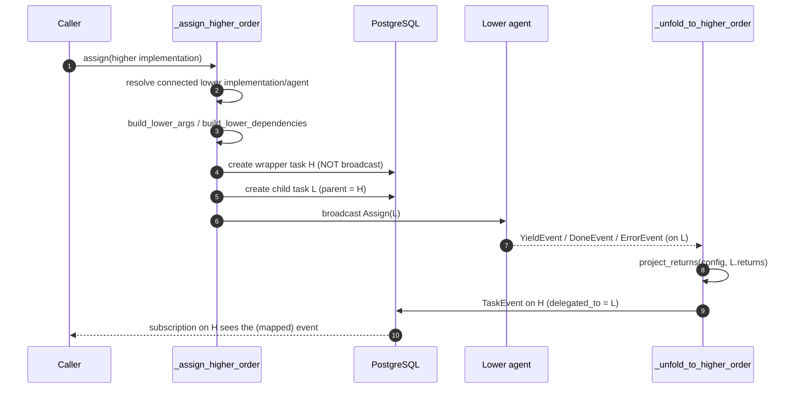

# Higher-Order Implementations

A **higher-order implementation (HOI)** is an implementation that wraps *another* implementation,
remapping its arguments, dependencies and returns. It is how Rekuest expresses partial application,
configuration presets, and cross-agent composition **without** the agents needing any orchestration
logic of their own — the server does the wiring.

Key files: `facade/higher_order.py` (pure projection functions), `facade/backend.py`
(`_assign_higher_order`), `facade/persist_backend.py` (`_unfold_to_higher_order`),
`Implementation.higher_order_for` / `higher_order_config` (`facade/models/implementation.py`).

## The model

An `Implementation` whose `higher_order_for` points at another implementation is a **wrapper** (`H`)
around a **wrapped/lower** implementation (`L`). The wrapper carries a `higher_order_config` dict
that declares how three channels are projected:

| Channel | Direction | Config keys |
| --- | --- | --- |
| args | caller → `L` | `bound`, `args_key`, `arg_map` |
| dependencies | `H`'s resolved deps → `L` | `dependency_map` |
| returns | `L` → caller | `return_map` |

The projection functions are deliberately **framework-free** (plain dicts in, plain dicts out) so
the remap/unfold contract is unit-testable without a database or the websocket stack.

## Two-tier execution: wrapper (virtual) + child (real)

When `assign` resolves a higher-order implementation it calls `_assign_higher_order` instead of the
normal path. Two tasks are created:

- **Wrapper task** (`H`) — the user-facing one. It is created with the original caller args
  but is **never broadcast to an agent**; its own agent need not even be connected. This is what the
  caller subscribes to and sees events on.
- **Child task** (`L`) — the real work. Its args/dependencies are projected from the wrapper,
  it is parented to the wrapper (`parent = H`, `root = H.root or H`), and it **is** broadcast to a
  freshly-resolved connected agent that implements the lower action.

The lower agent is **resolved at assign time** — `_assign_higher_order` looks for any connected,
recently-seen implementation of the lower action. So the wrapper can live on one agent (or none) and
the work can run on another: this is the cross-agent composition.

> **MVP limits:** a wrapper may not wrap another wrapper (no nesting), and wrapper and wrapped action
> `kind`s must agree (a `FUNCTION` wrapper can't wrap a `GENERATOR`, since unfolding is per-yield).
> Both are enforced at creation by `validate_higher_order_pairing`.

## Projecting arguments inward — `build_lower_args`

`build_lower_args(config, caller_args)` builds `L`'s args with this precedence (later wins on a key
clash):

1. **`bound`** — static params spread as `L`'s named args.
2. **`arg_map`** entries sourced `from: "caller"` — a named caller arg renamed onto an `L` port (and
   marked consumed). A referenced-but-missing caller arg is an error.
3. **Remaining caller args** (those not consumed by an explicit map) — either packed under
   `config["args_key"]` (reified into one dict port) or, if no `args_key`, spread directly by their
   original keys.

## Projecting dependencies inward — `build_lower_dependencies`

`build_lower_dependencies(config, resolved_h_dependencies)` takes the wrapper's *resolved* dependency
dict (an explicit, stored contract — see [task-lifecycle.md](task-lifecycle.md)) and
projects it onto `L`'s dependency slots:

- **Empty `dependency_map`** → pass-through by matching key.
- **Explicit map** → each lower key is sourced either `from: "bound"` (a static pre-resolved value)
  or `from: "caller"` (one of `H`'s declared dependencies, by key; missing ⇒ error).

`validate_dependency_coverage` checks at creation time that every lower slot is satisfiable and every
caller-sourced reference names a dependency the wrapper actually declares — so the caller knows what
to pass.

## Projecting returns outward — `project_returns`

`project_returns(config, lower_returns)` unfolds `L`'s returns back onto `H`'s return ports:

- `None` returns stay `None`.
- Empty/absent `return_map` → identity (returns passed through unchanged).
- Otherwise `return_map` is `{higher_return_key: lower_return_key}`, rebuilding the dict under the
  wrapper's keys.

## Server-side event unfolding

Because the user watches the **wrapper** but the work runs on the **child**, the server re-emits the
child's terminal/yield events onto the wrapper. `_unfold_to_higher_order` (called from the `YIELD` /
`DONE` / `CANCELLED` / `ERROR` / `CRITICAL` handlers in `persist_backend.py`):

1. Loads the child, finds its `parent`, and checks the parent's implementation is a wrapper
   (`higher_order_for_id is not None`). Non-higher-order children (hooks, dependency sub-assignments)
   are ignored.
2. Creates an `TaskEvent` on the **wrapper** with the same `kind`, linked via `delegated_to =
   child`. For `YIELD`, the returns are run through `project_returns` first.
3. On a terminal kind, marks the wrapper `is_done` and stamps `finished_at`.

That wrapper event then fans out to the caller's `ass_caller_{id}` channel exactly like any other
event ([realtime.md](realtime.md)) — so subscribers see the wrapper complete with mapped returns, as
if it had executed the work directly.

## Why this lives server-side

Putting the remap/unfold in Rekuest (not the agents) means: agents implement only their own concrete
actions; composition, presets and currying are catalogue-level concerns; and the contract is a pure,
testable dict transformation decoupled from the websocket and ORM layers. The single real
constraint is that the wrapper's resolved dependencies must be an explicit, declared contract — which
`validate_dependency_coverage` enforces up front.
