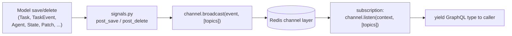

# Realtime: channels, signals & subscriptions

Rekuest pushes live updates to callers over GraphQL subscriptions. The plumbing has three layers:
**channels** (typed pub/sub over Redis), **signals** (Django model hooks that broadcast), and
**subscriptions** (async generators that listen and re-yield). This is separate from the agent
delivery queue — that is point-to-point work delivery; this is fan-out of *observations*.

Key files: `facade/channels.py`, `facade/channel_events.py`, `facade/signals.py`,
`facade/subscriptions/*`.

## The shape of it



A model change fires a Django signal; the signal handler broadcasts a small typed event to one or
more **topic strings**; a subscription that called `listen(...)` on those topics receives the event,
loads the referenced row, and yields it to the subscribed client.

## Channels — typed pub/sub

`facade/channels.py` builds channels with kante's `build_channel(EventModel, name)`. Each channel
carries a specific pydantic payload (`facade/channel_events.py`) — the payloads are intentionally
tiny (mostly just ids), so the subscription re-fetches the current row rather than trusting a
serialized snapshot:

| Channel | Payload | Carries |
| --- | --- | --- |
| `task_event_channel` | `TaskEventCreatedEvent` | `create` (task id) or `event` (event id) |
| `child_task_channel` | `ChildTaskEvent` | `create` / `update` (task id) |
| `agent_updated_channel` | `AgentSignal` | `create` / `update` / `delete` (agent id) |
| `new_implementation_channel` | `ImplementationSignal` | `create` / `update` / `delete` |
| `action_channel` | `ActionSignal` / `DBEvent` | action create/update |
| `state_update_channel` | `StateUpdateEvent` | `state` (state id) |
| `patch_channel` | `PatchEvent` | `create` (patch id), `state`, `agent` |

## Topic keys — who hears what

Broadcasts target **topic strings** that encode the audience. This is where access scoping happens:
a caller only subscribes to topics keyed by *its own* identity, an org only to its own, etc.

| Topic key | Audience / meaning |
| --- | --- |
| `ass_caller_{caller_id}` | A caller's own tasks + their events. |
| `child_tasks_{parent_id}` | Children of a specific task. |
| `agents_for_{org_id}` | Agent create/update/delete within an organization. |
| `actions_{org_id}` | Action create/update within an organization. |
| `implementation_{impl_id}` | Updates to one implementation (plus a global create channel). |
| `state_{state_id}` | A state record was updated. |
| `patches_state_{state_id}` | JSON patches to a state. |
| `patches_agent_{agent_id}` | JSON patches across an agent (any of its states). |

## Signals — what triggers a broadcast

`facade/signals.py` wires Django `post_save`/`post_delete` to broadcasts. The load-bearing ones:

- **Task created** → if it has a `caller_id`, broadcast `TaskEventCreatedEvent(create)`
  to `ass_caller_{caller_id}`. If it has a `parent`, also broadcast a `ChildTaskEvent` to
  `child_tasks_{parent.id}`.
- **TaskEvent created** → if the parent task has a `caller_id`, broadcast
  `TaskEventCreatedEvent(event)` to `ass_caller_{caller_id}`. This is how a caller sees each
  `PROGRESS`/`YIELD`/`DONE` as it is persisted.
- **Agent save/delete** → broadcast `AgentSignal(create|update|delete)` to
  `agents_for_{organization.id}`.
- **Action save** → `ActionSignal(create|update)` to `actions_{organization.id}`.
- **State save** → `StateUpdateEvent` to `state_{state.id}`.
- **Patch created** → `PatchEvent` to `patches_state_{state.id}`, and additionally
  `patches_agent_{agent.id}` when the patch names an agent.
- **Implementation save/delete** → `ImplementationSignal` on the global implementation channel and
  `implementation_{id}`.

Because the caller key (`ass_caller_{id}`) comes straight off `Task.caller_id`, the
requestor-identity model in [identity.md](identity.md) is exactly what makes "watch my own work"
work.

## Subscriptions — listen and re-yield

A subscription (`facade/subscriptions/*`) is an async generator that resolves the audience key,
calls `channel.listen(info.context, [topics])`, and for each message loads the referenced row and
yields the GraphQL type. Sketch of the tasks subscription:

```python
async def tasks(self, info: Info) -> AsyncGenerator[TaskChangeEvent, None]:
    caller, _ = await models.Caller.objects.aget_or_create(...)   # same identity as backend
    async for message in task_event_channel.listen(info.context, [f"ass_caller_{caller.id}"]):
        if message.create:
            yield TaskChangeEvent(create=await models.Task.objects.aget(id=message.create))
        elif message.event:
            yield TaskChangeEvent(event=await models.TaskEvent.objects.aget(id=message.event))
```

The major streams: `tasks` / `taskEvents` (caller-keyed), `childTasks`
(parent-keyed), `agents` (org-keyed), `implementations`, and the state streams below.

## The snapshot-then-stream pattern

State watching needs both the current value *and* subsequent changes, with no gap. `watch_state` /
`watch_agent` therefore **yield a snapshot first, then stream patches**:

1. Load the `State` (or all of an agent's states) and yield a snapshot event built from the current
   value + `global_rev`.
2. `listen` on `patches_state_{id}` (or `patches_agent_{id}`) and yield each subsequent `Patch`.

The `global_rev` revision counter on patches and snapshots lets the client order changes and detect
whether it has a contiguous view. State semantics (definitions, patches, snapshots, retention) are
in [domain-model.md](domain-model.md).

## Why two transports

It is worth restating the split:

- **Agent delivery** (work → agent) uses the **hand-rolled Redis queue** so messages survive an
  agent being briefly offline ([agent-protocol.md](agent-protocol.md)).
- **Realtime fan-out** (observations → callers) uses the **Channels layer** via these channels —
  best-effort pub/sub where a momentarily-absent subscriber simply misses events it can re-query.

Different reliability requirements, different transports.
