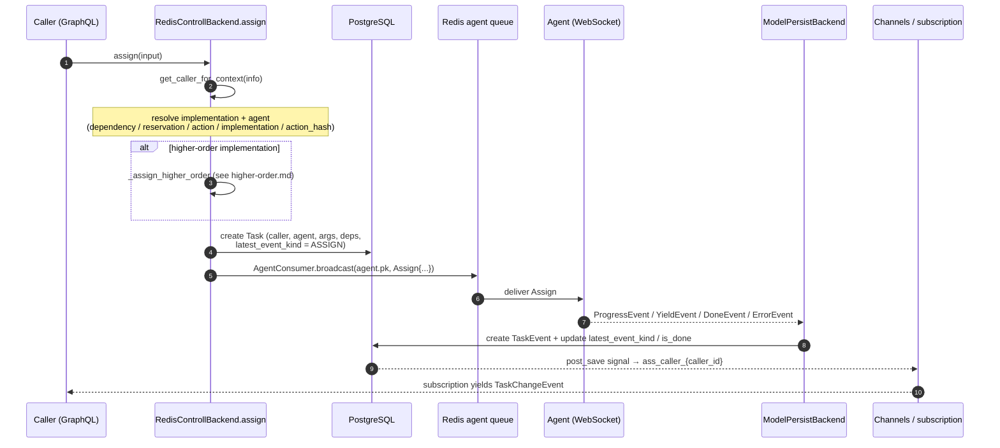
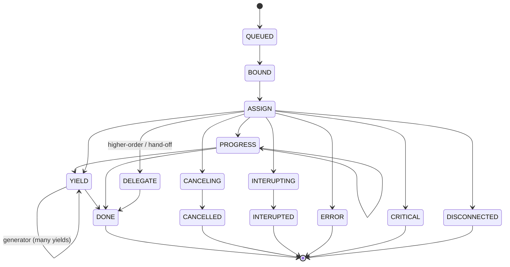

# Task Lifecycle: assign / reserve / events

An **Task** is the record of one task execution. This document traces its life: how `assign`
resolves an implementation and agent, how the work reaches the agent, how the agent's events are
persisted and fanned back to the caller, and the event state machine that governs it all. The
orchestration lives in `facade/backend.py` (`RedisControllBackend`) and `facade/persist_backend.py`
(`ModelPersistBackend`).

## The assign flow end to end



## Step 1 — identify the caller

Every `assign`/`reserve` begins with `get_caller_for_context(info)`, which `get_or_create`s the
`Caller` for the request's `(client, user, organization)` (see [identity.md](identity.md)). That
caller is stamped on the Task and is the key the caller later subscribes on.

## Step 2 — resolve implementation and agent

`RedisControllBackend.assign` accepts several mutually-exclusive routing inputs and resolves an
`implementation` + `agent` from whichever is set (checked in this order):

| Input | Resolution |
| --- | --- |
| `input.dependency` (+ `method`, `parent`) | Look up the parent task's resolved `dependencies`, pick a random agent for that dependency key, and take the implementation for `method`. |
| `input.reservation` | Pick a random implementation from the reservation's pool; use its agent. |
| `input.action` | Pick the first implementation whose agent is connected and recently seen (`last_seen > now - 1min`). |
| `input.implementation` | Use the implementation directly. For a normal (non higher-order) implementation, assert the agent is connected and recently seen. |
| `input.action_hash` | Resolve the action by `hash` within the org, then a connected implementation. |

If the resolved implementation is **higher-order** (`higher_order_for_id is not None`), assign
delegates to `_assign_higher_order` and returns — that path is described in
[higher-order.md](higher-order.md). The agent of a higher-order wrapper need not be connected; only
the resolved *lower* agent matters.

## Step 3 — resolve dependencies

Unless the dependency dict came pre-resolved from a parent, `build_dependency_dict` walks the
implementation's `Dependency` rows:

- **auto-resolvable / auto_resolve overwrite** — find connected agents matching `app_filter`
  (recently seen, in the request's org), clamped to `min`/`max_viable_instances` (raising if too
  few).
- **explicit overwrite** — restrict to the caller-supplied `mapped_agents`, same viability checks.
- a non-auto-resolvable dependency with no overwrite is an error.

The result is a nested dict `{dep_key: [{agent, actions: {key: {implementation, dependencies}}}]}`
stored on `Task.dependencies`, ready for the agent to fan out child tasks against.

## Step 4 — persist and broadcast

`assign` creates the `Task` (with `latest_event_kind = ASSIGN`,
`latest_instruct_kind = ASSIGN`, `caller`, `agent`, `args`, `acted_on`, resolved `dependencies`,
`ephemeral`/`capture` flags) and then broadcasts the work:

```python
AgentConsumer.broadcast(
    task.agent.pk,
    message=messages.Assign(
        task=str(task.pk),
        args=input.args,
        user=str(info.context.request.user.sub),
        app=str(info.context.request.client.client_id),
        org=...,
        interface=implementation.interface,
        action=str(implementation.action.hash),
        ...
    ),
)
```

`broadcast` pushes onto the Redis **agent queue** (not the Channels layer) so a message survives if
the agent is momentarily offline — see [agent-protocol.md](agent-protocol.md). Any `INIT` lifecycle
hooks on the input are recursively assigned as child tasks.

## Step 5 — the agent reports, the server persists

The agent streams events back over its socket; `ModelPersistBackend` handles each
(`facade/persist_backend.py`):

| Agent event | Persisted as | Side effects |
| --- | --- | --- |
| `ProgressEvent` | `TaskEvent(PROGRESS, progress, message)` | — |
| `LogEvent` | `TaskEvent(LOG, message)` | — |
| `YieldEvent` | `TaskEvent(YIELD, returns)` | unfold to higher-order wrapper |
| `DoneEvent` | `TaskEvent(DONE)` | set `is_done`, `finished_at`, `latest_event_kind` |
| `CancelledEvent` | `TaskEvent(CANCELLED)` | terminal (set `is_done` …) |
| `ErrorEvent` | `TaskEvent(ERROR, message)` | terminal |
| `CriticalEvent` | `TaskEvent(CRITICAL, message)` | terminal |

Terminal events set `is_done = True` and stamp `finished_at`. `YIELD`/`DONE`/error events also call
`_unfold_to_higher_order` so a wrapper task sees a mapped event when its child finishes (see
[higher-order.md](higher-order.md)).

## Step 6 — fan back to the caller

Creating an `TaskEvent` (and the Task itself) fires Django `post_save` signals that
broadcast to the caller's realtime channel `ass_caller_{caller_id}`. The caller's `tasks` /
`taskEvents` subscription is listening there and re-yields the change. The full channel/
signal/subscription mechanism is [realtime.md](realtime.md).

## The event state machine

`TaskEvent.kind` (enum `TaskEventKind`, `facade/enums/task.py`) records each
transition; `Task.latest_event_kind` denormalizes the current one for fast reads.



- `QUEUED` → `BOUND` → `ASSIGN` is the path to a running task; `LOG` and `PROGRESS` are non-terminal
  annotations along the way.
- `YIELD` carries returns — a `FUNCTION` yields once, a `GENERATOR` many times.
- Terminal kinds: `DONE`, `CANCELLED`, `INTERUPTED`, `ERROR`, `CRITICAL`, and `DISCONNECTED` (the
  agent dropped mid-task; "fate unknown").

## Instructing a running task

A caller steers in-flight work with **instructs** (`TaskInstructKind`): `CANCEL`, `PAUSE`,
`RESUME`, `STEP`, `INTERRUPT`, `COLLECT`. Each backend method (`cancel`, `interrupt`, `step`,
`resume`, …) sets `Task.latest_instruct_kind` and broadcasts the corresponding
`messages.*` to the agent — and, importantly, **forwards to children** (e.g. `cancel`/`interrupt`
propagate to the lower task a higher-order wrapper delegated to, possibly on another agent).

## Reservations — standing pools

`reserve` (`backend.py`) `update_or_create`s a `Reservation` for a `(reference, caller)`,
associates an `action` and its set of `implementations`, and stores a `strategy`
(default `ROUND_ROBIN`). A reservation is a durable channel: later `assign`s targeting it route to
one of the pooled implementations by strategy, instead of re-resolving each time. Reservations are
optional — direct `assign` to an action/implementation works without one.

## Disconnect handling

When an agent drops, `on_agent_disconnected` (guarded by `active_connection_id`, see
[agent-protocol.md](agent-protocol.md)) marks every still-running task **owned by that agent**
(`agent_id=…, is_done=False`) with a `DISCONNECTED` event. The filter is on the **direct `agent`
FK** deliberately — a task may have a null/reassigned `implementation`, so filtering through
`implementation__agent` would silently skip work the agent actually owns.

## Ephemeral vs persistent

`Task.ephemeral` trades audit history for storage: ephemeral tasks are meant to be
discarded after completion, persistent ones are kept as an audit trail. `capture` independently
controls whether logs/events are retained for debugging.
